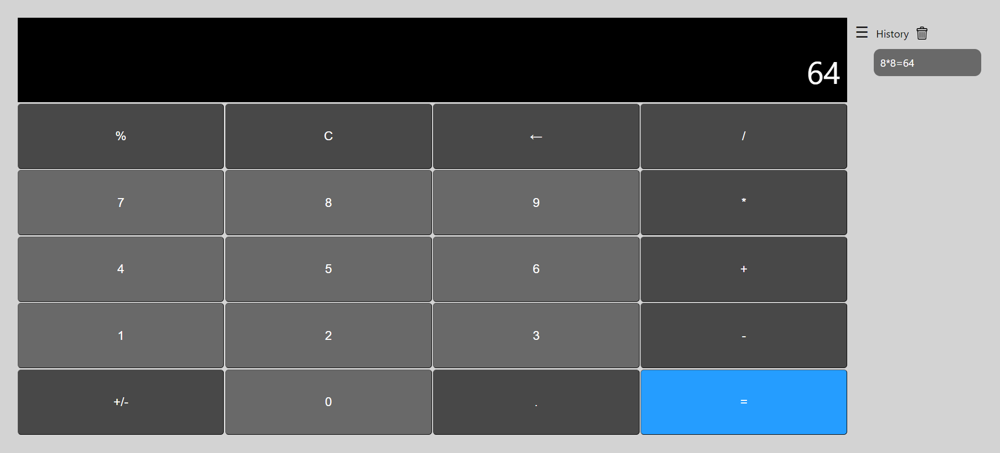

This is a [Next.js](https://nextjs.org/) project of a simple calculator.



## Getting Started

First, install all necessary package:
```bash
npm install
```

Then, run the development server:

```bash
npm run dev
# or
yarn dev
```

Open [http://localhost:3000](http://localhost:3000) with your browser to see the calculator.

The api to get the result of an expression is reachable with a GET call to `/api/result?expression=-2*5`